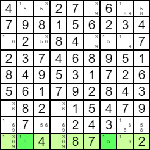
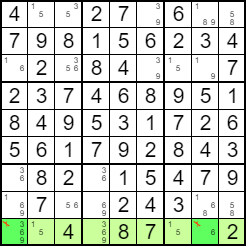
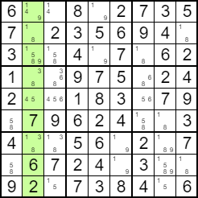
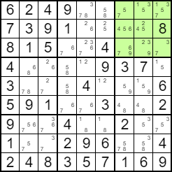

# Napredne tehnike
## Ogoljeni par (Naked Pair) 
U retku 9 skup ćelija (9, 2) i (9, 7) zajedno može sadržavati jedino vrijednosti iz skupa {1, 5}, pa se taj skup vrijednosti sigurno nalazi unutar tog skupa ćelija u tom retku.



Možemo ukloniti mogućnost 1 iz ćelija (9, 1) i (9, 8).



Slično pravilo vrijedi i za stupce, ne samo za retke, te za skupove ćelija i vrijednosti veće od 2. Bitno je samo da je veličina skupa ćelija jednaka veličini skupa mogućih vrijednosti koje one zajedno pokrivaju.

## Ogoljena trojka (Naked Triple)
Evo primjera sa skupom vrijednosti {1, 3, 8} u ćelijama (2, 2), (4, 2) i (7, 2). Vrijednost 1 se može ukloniti iz ćelija (1, 2) i (3, 2), a vrijednost 3 se može ukloniti iz ćelije (5, 2).


## Ogoljena četvorka (Naked Quad)
Slično pravilo vrijedi i za kutije. U kutiji 3 skup četiri vrijednosti {1, 3, 5, 7} pokriven je ćelijama (1, 7), (1, 8), (1, 9) i (3, 9). Mogućnost 3 se može ukloniti iz ćelije (3, 8), vrijednost 5 se može ukloniti iz ćelija (2, 7) i (2, 8), a vrijednost 7 iz ćelije (3, 7).





```java
public int nakedSetForRow (int i, int j, Set<Integer> sameRow) {
    int num = i * cols + j;
    for (int k = j + 1; k < cols; k++) {
        int num2 = i * cols + k;
        if (numPossibilities[num2] <= 1) {
            continue;
        }
        int match = 0;
        for (int kh = 0; kh < k; kh++) {
            int num3 = i * cols + kh;
            if (numPossibilities[num3] <= 1) {
                continue;
            }
            if (num3 == num || sameRow.contains(num3)) {
                for (int hg = 0; hg < cols; hg++) {
                    if (possibilities[num2][hg] == 1 && possibilities[num3][hg] == 1 && !sameRow.contains(num2) && num2 != num) {
                        match++;
                        break;
                    }
                }
            }
        }
        if (match == sameRow.size() + 1) {
            Set<Integer> sameRow2 = new HashSet<Integer>();
            for (int kh = 0; kh < rows * cols; kh++) {
                if (sameRow.contains(kh)) {
                    sameRow2.add(kh);
                }
            }
            sameRow2.add(num2);
            if (nakedSetForRow(i, j, sameRow2) == 1) {
                difficulty.setText(String.valueOf(difficultyScore) + " Postoji jedinstveno rješenje");
                return 1;
            }
        }
        int matchStringLen = 0;
        String ms = "";
        for (int hg = 0; hg < cols; hg++) {
            String c = "0";
            for (int kh = 0; kh < cols; kh++) {
                int num3 = i * cols + kh;
                if (sameRow.contains(num3) || num3 == num) {
                    if (possibilities[num3][hg] == 1) {
                        c = "1";
                        matchStringLen++;
                        break;
                    }
                }
            }
            ms += c;
        }
        if (sameRow.size() == matchStringLen - 1 && sameRow.size() > 0) {
            int numRemoved = 0;
            for (int fg = 0; fg < cols; fg++) {
                int num3 = i * cols + fg;
                if (!sameRow.contains(num3) && num3 != num) {
                    for (int hg = 0; hg < cols; hg++) {
                        if (ms.charAt(hg) == '1' && possibilities[num3][hg] == 1 && temporary[num3] == 0) {
                            if (numRemoved == 0) {
						    	// upiši pojavu ogoljenog skupa, dodaj odgovarajuću težinu i upute za rješavanje
                            }
                            solvingInstructions += "Removing possibility " + String.valueOf(hg + 1) + " from cell (" + String.valueOf(num3 / cols + 1) + ", " + String.valueOf(num3 % cols + 1) + ").\n";
                            if (showSteps == true) {
                                instructionArea.setText(solvingInstructions);
                                print();
                                InformationBox.infoBox("Removing possibility " + String.valueOf(hg + 1) + " from cell (" + String.valueOf(num3 / cols + 1) + ", " + String.valueOf(num3 % cols + 1) + ").", "Solver");
                            }
                            possibilities[num3][hg] = 0;
                            numRemoved++;
                        }
                    }
                }
            }
            if (numRemoved == 0) {
                continue;
            }
            if (sequence() == 1) {
                difficulty.setText(String.valueOf(difficultyScore) + " Postoji jedinstveno rješenje");
                return 1;
            }
        }
    }
    return 0;
}

public int nakedSetForCol (int i, int j, Set<Integer> sameColumn) {
    int num = i * cols + j;
    for (int k = i + 1; k < rows; k++) {
        int num2 = k * cols + j;
        if (numPossibilities[num2] <= 1) {
            continue;
        }
        int match = 0;
        for (int kh = 0; kh < k; kh++) {
            int num3 = kh * cols + j;
            if (numPossibilities[num3] <= 1) {
                continue;
            }
            if (num3 == num || sameColumn.contains(num3)) {
                for (int hg = 0; hg < cols; hg++) {
                    if (possibilities[num2][hg] == 1 && possibilities[num3][hg] == 1 && !sameColumn.contains(num2) && num2 != num) {
                        match++;
                        break;
                    }
                }
            }
        }
        if (match == sameColumn.size() + 1) {
            Set<Integer> sameColumn2 = new HashSet<Integer>();
            for (int kh = 0; kh < rows * cols; kh++) {
                if (sameColumn.contains(kh)) {
                    sameColumn2.add(kh);
                }
            }
            sameColumn2.add(num2);
            if (nakedSetForCol(i, j, sameColumn2) == 1) {
                difficulty.setText(String.valueOf(difficultyScore) + " Postoji jedinstveno rješenje");
                return 1;
            }
        }
        int matchStringLen = 0;
        String ms = "";
        for (int hg = 0; hg < cols; hg++) {
            String c = "0";
            for (int kh = 0; kh < rows; kh++) {
                int num3 = kh * cols + j;
                if (sameColumn.contains(num3) || num3 == num) {
                    if (possibilities[num3][hg] == 1) {
                        c = "1";
                        matchStringLen++;
                        break;
                    }
                }
            }
            ms += c;
        }
        if (sameColumn.size() == matchStringLen - 1 && sameColumn.size() > 0) {
            int numRemoved = 0;
            for (int fg = 0; fg < rows; fg++) {
                int num3 = fg * cols + j;
                if (!sameColumn.contains(num3) && num3 != num) {
                    for (int hg = 0; hg < cols; hg++) {
                        if (ms.charAt(hg) == '1' && possibilities[num3][hg] == 1 && temporary[num3] == 0) {
                            if (numRemoved == 0) {
						    	// upiši pojavu ogoljenog skupa, dodaj odgovarajuću težinu i upute za rješavanje
                            }
                            solvingInstructions += "Removing possibility " + String.valueOf(hg + 1) + " from cell (" + String.valueOf(num3 / cols + 1) + ", " + String.valueOf(num3 % cols + 1) + ").\n";
                            if (showSteps == true) {
                                instructionArea.setText(solvingInstructions);
                                print();
                                InformationBox.infoBox("Removing possibility " + String.valueOf(hg + 1) + " from cell (" + String.valueOf(num3 / cols + 1) + ", " + String.valueOf(num3 % cols + 1) + ").", "Solver");
                            }
                            possibilities[num3][hg] = 0;
                            numRemoved++;
                        }
                    }
                }
            }
            if (numRemoved == 0) {
                continue;
            }
            if (sequence() == 1) {
                difficulty.setText(String.valueOf(difficultyScore) + " Postoji jedinstveno rješenje");
                return 1;
            }
        }
    }
    return 0;
}

public int nakedSetForBox(int i, int j, Set<Integer> sameBox) {
    int num = i * cols + j;
    for (int k = num + 1; k < rows * cols; k++) {
        if (boxNumber[k] != boxNumber[num]) {
            continue;
        }
        if (numPossibilities[k] <= 1) {
            continue;
        }
        int match = 0;
        for (int k2 = 0; k2 < k; k2++) {
            if (boxNumber[k2] != boxNumber[num]) {
                continue;
            }
            if (numPossibilities[k2] <= 1) {
                continue;
            }
            if (k2 == num || sameBox.contains(k2)) {
                for (int hg = 0; hg < cols; hg++) {
                    if (possibilities[k][hg] == 1 && possibilities[k2][hg] == 1 && !sameBox.contains(k) && k != num) {
                        match++;
                        break;
                    }
                }
            }
        }
        if (match == sameBox.size() + 1) {
            Set<Integer> sameBox2 = new HashSet<Integer>();
            for (int kh = 0; kh < rows * cols; kh++) {
                if (sameBox.contains(kh)) {
                    sameBox2.add(kh);
                }
            }
            sameBox2.add(k);
            if (nakedSetForBox(i, j, sameBox2) == 1) {
                difficulty.setText(String.valueOf(difficultyScore) + " Postoji jedinstveno rješenje");
                return 1;
            }
        }
        int matchStringLen = 0;
        String ms = "";
        for (int hg = 0; hg < cols; hg++) {
            String c = "0";
            for (int kh = 0; kh < rows * cols; kh++) {
                if (boxNumber[num] != boxNumber[kh]) {
                    continue;
                }
                if (sameBox.contains(kh) || kh == num) {
                    if (possibilities[kh][hg] == 1) {
                        c = "1";
                        matchStringLen++;
                        break;
                    }
                }
            }
            ms += c;
        }
        if (sameBox.size() == matchStringLen - 1 && sameBox.size() > 0) {
            int numRemoved = 0;
            for (int fg = 0; fg < rows * cols; fg++) {
                int num3 = fg;
                if (boxNumber[num] != boxNumber[num3]) {
                    continue;
                }
                if (!sameBox.contains(num3) && num3 != num) {
                    for (int hg = 0; hg < cols; hg++) {
                        if (ms.charAt(hg) == '1' && possibilities[num3][hg] == 1 && temporary[num3] == 0) {
                            if (numRemoved == 0) {
						    	// upiši pojavu ogoljenog skupa, dodaj odgovarajuću težinu i upute za rješavanje
                            }
                            solvingInstructions += "Removing possibility " + String.valueOf(hg + 1) + " from cell (" + String.valueOf(num3 / cols + 1) + ", " + String.valueOf(num3 % cols + 1) + ").\n";
                            if (showSteps == true) {
                                instructionArea.setText(solvingInstructions);
                                print();
                                InformationBox.infoBox("Removing possibility " + String.valueOf(hg + 1) + " from cell (" + String.valueOf(num3 / cols + 1) + ", " + String.valueOf(num3 % cols + 1) + ").", "Solver");
                            }
                            possibilities[num3][hg] = 0;
                            numRemoved++;
                        }
                    }
                }
            }
            if (numRemoved == 0) {
                continue;
            }
            if (sequence() == 1) {
                difficulty.setText(String.valueOf(difficultyScore) + " Postoji jedinstveno rješenje");
                return 1;
            }
        }
    }
    return 0;
}

public int nakedSet() {
    numPossibilities = new int[rows * cols];
    
    for (int i = 0; i < rows; i++){
        for (int j = 0; j < cols; j++) {
            int num = i * cols + j;
            numPossibilities[num] = 0;
            for (int k = 0; k < cols; k++) {
                numPossibilities[num] += possibilities[i * cols + j][k];
            }
        }
    }
    for (int i = 0; i < rows; i++){
        for (int j = 0; j < cols; j++) {
            int num = i * cols + j;
            if (numPossibilities[num] <= 1) {
                continue;
            }
            if (temporary[num] != 0) {
                continue;
            }
            Set<Integer> sameRow = new HashSet<Integer>();
            if (nakedSetForRow(i, j, sameRow) == 1) {
                difficulty.setText(String.valueOf(difficultyScore) + " Postoji jedinstveno rješenje");
                return 1;
            }

            Set<Integer> sameColumn = new HashSet<Integer>();
            if (nakedSetForCol(i, j, sameColumn) == 1) {
                difficulty.setText(String.valueOf(difficultyScore) + " Postoji jedinstveno rješenje");
                return 1;
            }

            Set<Integer> sameBox = new HashSet<Integer>();
            if (nakedSetForBox(i, j, sameBox) == 1) {
                difficulty.setText(String.valueOf(difficultyScore) + " Postoji jedinstveno rješenje");
                return 1;
            }
        }
    }
    return 0;
}
```

## Skriveni par (Hidden Pair)	


## Skrivena trojka (Hidden Triple)	


```java
public int hiddenSetForRow(int k1, int i, Set<Integer> sameRowValues) {
		for (int k = k1 + 1; k < cols; k++) {
			if (k == k1 || sameRowValues.contains(k)) {
    			continue;
    		}
    		int match = 0;
    		for (int kh = 0; kh < cols; kh++) {
    			if (kh == k1 || sameRowValues.contains(kh)) {
		    		for (int hg = 0; hg < cols; hg++) {
		    			if (valuePos[k].charAt(hg) == '1' && valuePos[kh].charAt(hg) == '1') {
		    				match++;
		    				break;
		    			}
		    		}
    			}
    		}
    		if (match == sameRowValues.size() + 1) {
    			Set<Integer> sameRowValues2 = new HashSet<Integer>();
        		for (int kh = 0; kh < cols; kh++) {
        			if (sameRowValues.contains(kh)) {
        				sameRowValues2.add(kh);
        			}
        		}
				sameRowValues2.add(k);
				if (hiddenSetForRow(k1, i, sameRowValues2) == 1) {
	    			difficulty.setText(String.valueOf(difficultyScore) + " Postoji jedinstveno rješenje");
	    			return 1;
				}
    		}
	    	int matchStringLen = 0;
	    	String ms = "";
	    	for (int hg = 0; hg < cols; hg++) {
	    		String c = "0";
	    		for (int kh = 0; kh < cols; kh++) {
	    			if (kh == k1 || sameRowValues.contains(kh)) {
				    	if (valuePos[kh].charAt(hg) == '1') {
				    		c = "1";
				    		matchStringLen++;
				    		break;
				    	}
	    			}
	    		}
	    		ms += c;
    		}
	    	if (sameRowValues.size() == matchStringLen - 1 && sameRowValues.size() > 0) {
	    		int numRemoved = 0;
				for (int q = 0; q < cols; q++) {
					if (ms.charAt(q) == '1') {
						 for (int k2 = 0; k2 < cols; k2++) {
							if (!sameRowValues.contains(k2) && k2 != k1 && possibilities[i * cols + q][k2] == 1) {
						    	if (numRemoved == 0) {
						    		// upiši pojavu skrivenog skupa, dodaj odgovarajuću težinu i upute za rješavanje
						    	}		    			    		
								solvingInstructions += "Removing possibility " + String.valueOf(k2 + 1) + " from cell (" + String.valueOf(i + 1) + ", " + String.valueOf(q + 1) + ").\n" ;
								if (showSteps == true) {
					    		    instructionArea.setText(solvingInstructions);
			    		    		print();
			    	    			InformationBox.infoBox("Removing possibility " + String.valueOf(k2 + 1) + " from cell (" + String.valueOf(i + 1) + ", " + String.valueOf(q + 1) + ").", "Solver");
					    		}
			    				possibilities[i * cols + q][k2] = 0;
					    		numRemoved++;
							} 
						}
					}
				}
	    		if (numRemoved == 0) {
	    			continue;
	    		}
				if (sequence() == 1) {
	    			difficulty.setText(String.valueOf(difficultyScore) + " Postoji jedinstveno rješenje");
	    			return 1;
				}
	    	}
		}
		return 0;
	}
	
	public int hiddenSetForCol(int k1, int i, Set<Integer> sameColValues) {	
		for (int k = k1 + 1; k < cols; k++) {
			if (k == k1 || sameColValues.contains(k)) {
				continue;
			}
			int match = 0;
			for (int kh = 0; kh < cols; kh++) {
				if (kh == k1 || sameColValues.contains(kh)) {
		    		for (int hg = 0; hg < cols; hg++) {
		    			if (valuePos[k].charAt(hg) == '1' && valuePos[kh].charAt(hg) == '1') {
		    				match++;
		    				break;
		    			}
		    		}
				}
			}
    		if (match == sameColValues.size() + 1) {
    			Set<Integer> sameColValues2 = new HashSet<Integer>();
        		for (int kh = 0; kh < cols; kh++) {
        			if (sameColValues.contains(kh)) {
        				sameColValues2.add(kh);
        			}
        		}
        		sameColValues2.add(k);
				if (hiddenSetForCol(k1, i, sameColValues2) == 1) {
	    			difficulty.setText(String.valueOf(difficultyScore) + " Postoji jedinstveno rješenje");
	    			return 1;
				}
    		}
	    	int matchStringLen = 0;
	    	String ms = "";
	    	for (int hg = 0; hg < cols; hg++) {
	    		String c = "0";
	    		for (int kh = 0; kh < cols; kh++) {
	    			if (kh == k1 || sameColValues.contains(kh)) {
				    	if (valuePos[kh].charAt(hg) == '1') {
				    		c = "1";
				    		matchStringLen++;
				    		break;
				    	}
	    			}
	    		}
	    		ms += c;
    		}
	    	if (sameColValues.size() == matchStringLen - 1 && sameColValues.size() > 0) {
				int numRemoved = 0;
				for (int q = 0; q < rows; q++) {
					if (ms.charAt(q) == '1') {
						for (int k2 = 0; k2 < cols; k2++) {
							if (!sameColValues.contains(k2) && k2 != k1 && possibilities[q * cols + i][k2] == 1) {
						    	if (numRemoved == 0) {
                                    // upiši pojavu skrivenog skupa, dodaj odgovarajuću težinu i upute za rješavanje
						    	}		    			    	    		
								solvingInstructions += "Removing possibility " + String.valueOf(k2 + 1) + " from cell (" + String.valueOf(q + 1) + ", " + String.valueOf(i + 1) + ").\n";
								if (showSteps == true) {
					    		    instructionArea.setText(solvingInstructions);
			    		    		print();
			    	    			InformationBox.infoBox("Removing possibility " + String.valueOf(k2 + 1) + " from cell (" + String.valueOf(q + 1) + ", " + String.valueOf(i + 1) + ").", "Solver");
					    		}
								possibilities[q * cols + i][k2] = 0;
			    				numRemoved++;
							}
						}
					}
				}
	    		if (numRemoved == 0) {
	    			continue;
	    		}
				if (sequence() == 1) {
	    			difficulty.setText(String.valueOf(difficultyScore) + " Postoji jedinstveno rješenje");
	    			return 1;
				}
			}
		}
		return 0;
	}
	
	public int hiddenSetForBox(int k1, int i, Set<Integer> sameBoxValues) {	
		for (int k = k1 + 1; k < cols; k++) {
			if (k == k1 || sameBoxValues.contains(k)) {
				continue;
			}
			int match = 0;
			for (int kh = 0; kh < cols; kh++) {
				if (kh == k1 || sameBoxValues.contains(kh)) {
		    		for (int hg = 0; hg < cols; hg++) {
		    			if (valuePos[k].charAt(hg) == '1' && valuePos[kh].charAt(hg) == '1') {
		    				match++;
		    				break;
		    			}
		    		}
				}
			}
    		if (match == sameBoxValues.size() + 1) {
    			Set<Integer> sameBoxValues2 = new HashSet<Integer>();
        		for (int kh = 0; kh < cols; kh++) {
        			if (sameBoxValues.contains(kh)) {
        				sameBoxValues2.add(kh);
        			}
        		}
        		sameBoxValues2.add(k);
				if (hiddenSetForBox(k1, i, sameBoxValues2) == 1) {
	    			difficulty.setText(String.valueOf(difficultyScore) + " Postoji jedinstveno rješenje");
	    			return 1;
				}
			}
	    	int matchStringLen = 0;
	    	String ms = "";
	    	for (int hg = 0; hg < cols; hg++) {
	    		String c = "0";
	    		for (int kh = 0; kh < cols; kh++) {
	    			if (kh == k1 || sameBoxValues.contains(kh)) {
				    	if (valuePos[kh].charAt(hg) == '1') {
				    		c = "1";
				    		matchStringLen++;
				    		break;
				    	}
	    			}
	    		}
	    		ms += c;
    		}
	    	if (sameBoxValues.size() == matchStringLen - 1 && sameBoxValues.size() > 0) {
				int q = -1;
				int numRemoved = 0;
				for (int y = 0; y < rows * cols; y++) {
		    		if (i != boxNumber[y]) {
		    			continue;
		    		} else {
		    			q++;
		    		}
					if (ms.charAt(q) == '1') {
						for (int k2 = 0; k2 < cols; k2++) {
							if (!sameBoxValues.contains(k2) && k2 != k1 && possibilities[y][k2] == 1) {
						    	if (numRemoved == 0) {
						    		// upiši pojavu skrivenog skupa, dodaj odgovarajuću težinu i upute za rješavanje
						    	}		 
								solvingInstructions += "Removing possibility " + String.valueOf(k2 + 1) + " from cell (" + String.valueOf(y / cols + 1) + ", " + String.valueOf(y % cols + 1) + ").\n";
								if (showSteps == true) {
					    		    instructionArea.setText(solvingInstructions);
			    		    		print();
			    	    			InformationBox.infoBox("Removing possibility " + String.valueOf(k2 + 1) + " from cell (" + String.valueOf(y / cols + 1) + ", " + String.valueOf(y % cols + 1) + ").", "Solver");
					    		}
								possibilities[y][k2] = 0;
			    				numRemoved++;
							}
						}
					}
				}
	    		if (numRemoved == 0) {
	    			continue;
	    		}
				if (sequence() == 1) {
	    			difficulty.setText(String.valueOf(difficultyScore) + " Postoji jedinstveno rješenje");
	    			return 1;
				}
			}
		}
		return 0;
	}
	
	
	public int hiddenSet() {
	    for (int i = 0; i < rows; i++){
    		for (int k = 0; k < cols; k++) {
    			valuePos[k] = "";
    			numPos[k] = 0;
    		}
	    	for (int j = 0; j < cols; j++) {
	    		for (int k = 0; k < cols; k++) {
	    			if (possibilities[i * cols + j][k] == 1 && temporary[i * cols + j] == 0) {
	    				valuePos[k] += "1";
	    				numPos[k]++;
	    			} else {
	    				valuePos[k] += "0";
	    			}
	    		}
		    }
			for (int k1 = 0; k1 < cols; k1++) {
				Set<Integer> sameRowValues = new HashSet<Integer>();
				if (hiddenSetForRow(k1, i, sameRowValues) == 1) {
					if (sequence() == 1) {
		    			difficulty.setText(String.valueOf(difficultyScore) + " Postoji jedinstveno rješenje");
		    			return 1;
					}
				}
			}
		}

	    for (int i = 0; i < cols; i++){
    		for (int k = 0; k < rows; k++) {
    			valuePos[k] = "";
    			numPos[k] = 0;
    		}
	    	for (int j = 0; j < rows; j++) {
	    		for (int k = 0; k < cols; k++) {
	    			if (possibilities[j * cols + i][k] == 1 && temporary[j * cols + i] == 0) {
	    				valuePos[k] += "1";
	    				numPos[k]++;
	    			} else {
	    				valuePos[k] += "0";
	    			}
	    		}
		    }
			for (int k1 = 0; k1 < cols; k1++) {
				Set<Integer> sameColValues = new HashSet<Integer>();
				if (hiddenSetForCol(k1, i, sameColValues) == 1) {
    				if (sequence() == 1) {
    	    			difficulty.setText(String.valueOf(difficultyScore) + " Postoji jedinstveno rješenje");
    	    			return 1;
    				}
				}
			}
		}

	    for (int i = 0; i < cols; i++){
			for (int k = 0; k < cols; k++) {
				valuePos[k] = "";
				numPos[k] = 0;
			}
	    	for (int j = 0; j < rows * cols; j++) {
	    		if (i != boxNumber[j]) {
	    			continue;
	    		}
	    		for (int k = 0; k < cols; k++) {
	    			if (possibilities[j][k] == 1 && temporary[j] == 0) {
	    				valuePos[k] += "1";
	    				numPos[k]++;
	    			} else {
	    				valuePos[k] += "0";
	    			}
	    		}
		    }
	    	
			for (int k1 = 0; k1 < cols; k1++) {
				Set<Integer> sameBoxValues = new HashSet<Integer>();
				if (hiddenSetForBox(k1, i, sameBoxValues) == 1) {
    				if (sequence() == 1) {
    	    			difficulty.setText(String.valueOf(difficultyScore) + " Postoji jedinstveno rješenje");
    	    			return 1;
    				}
				}
			}
	    }

		return 0;
	}
```