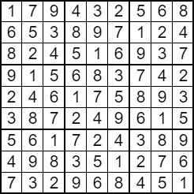
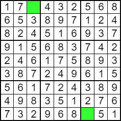
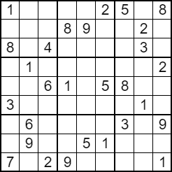

# [Nasumično generiranje zagonetke](https://www.sudokuoftheday.com/about/difficulty/ "Sudoku Diffficulty - Sudoku of the Day")
# Razine težine 

| Razina | Prosječna težina | Najmanja težina | Najveća težina |
|---|---|---|---| 
| Početnička | 4000 | 3600 | 4500 |
| Lagano | 4900 | 4300 | 5500 | 
| Srednje | 6000 | 5300 | 6900 |
| Zakučasto | 7600 | 6500 | 9300 |
| Neprijateljski | 10000 | 8300 | 14000 |
| Pakleno | 18000 | 11000 | 25000 |

Napomena: Ovi rasponi vrijede za standardnu 9 * 9 zagonetku.

Za evaluaciju težine, vidjeti [tehnike](tehnike.md).

# Kako se stvara nasumična zagonetka tražene težine?

Budući da težina raste što je manje polja zadano, počinje se s potpuno ispunjenom mrežom koja je nasumično generirana pa se reducira broj otkrivenih polja. 

1. Ispravna i dovršena mreža se nasumično generira.



2. Odabire se nasumična ćelija (koja još nije sakrivena) te se skriva zajedno sa ćelijom koja joj je rotacijski simetrična. Dokazano je da je veća vjerojatnost da će zagonetka ostati rješiva ako se održava rotacijska simetričnost praznina. Središnja ćelija u zagonetkama s neparnim brojem redaka i stupaca nema rotacijski simetričan par pa se u tom slučaju uklanja sama. 



3. Prethodni korak se ponavlja sve dok težina ne bude unutar željenog raspona, ali samo ako je zagonetka još uvijek rješiva. Nakon svakog koraka vrši se provjera rješivosti i težine. 
5. Ukoliko uklanjanje koraku rezultira zagonetkom koja nema jedinstveno rješenje pomoću logičkih tehnika, već samo pogađanjem, poništavamo korake uklanjanja i otkrivamo parove polja sve dok zagonetka ne postane opet rješiva. Korak se poništava čak i ako je zagonetka rješiva u slučaju da je težina premašila maksimalnu vrijednost nakon zadnjeg uklanjanja polja.
6. Ukoliko smo već previše puta poništavali korake uklanjanja, isplativije je vratiti se na prvi korak i ponovno nasumično generirati ispravnu i dovršenu mrežu. Kao mjerilo za maksimalni broj poništenih uklanjanja uzima se ukupan broj ćelija podjeljen s dva zbog rotacijske simetrije.  
7. Ukoliko se postupak nije dovršio unutar 10 sekundi, prva iduća generirana rješiva zagonetka se daje korisniku, čak i ako joj težina nije u traženom rasponu, da bi vrijeme čekanja ostalo prihvatljivo. 

Primjer završenog postupka: 



```java
int solvable = 0;
int numReturns = 0;
mintargetDifficulty = mint;
maxtargetDifficulty = maxt;
long startGen = System.currentTimeMillis();
while (solvable == 0 || difficultyScore > maxtargetDifficulty || difficultyScore < mintargetDifficulty) 
{
    removeSymetricPair();
    solvable = isOnlyOneSolution();
    //System.out.println(String.valueOf(difficultyScore));
    if (solvable == 0) {
        numReturns++;
        restoreLastRemoved();
        solvable = isOnlyOneSolution();
        //System.out.println("backtrack " + String.valueOf(difficultyScore));
    } else {
        numReturns = 0;
    }
    if (numReturns >= rows * cols / 2) {
        while (restoreLastRemoved()) {
            
        }
        difficultyScore = 0;
        numReturns = 0;
    }
    if (solvable == 1 && System.currentTimeMillis() - startGen >= 10000) {
        break;
    }
}
```