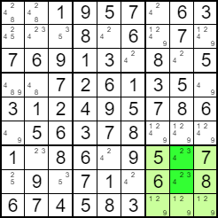
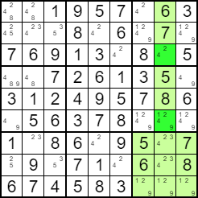
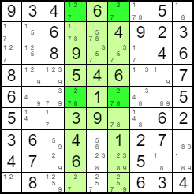
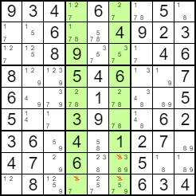
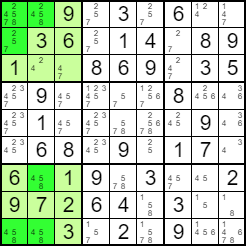
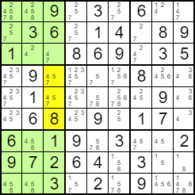
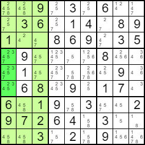

# Srednje složene tehnike 

## [Linija kandidata (Candidate Lines)](https://www.sudokuoftheday.com/about/techniques/candidate-line "Candidate Lines")
## 
U kutiji broj 9 (dolje desno, svjetlo zelena boja) svi kandidati za broj 4 (tamno zelene ćelije), a to su  (7, 8) i (8, 8), nalaze se stupcu 8. To znači da broj 4 mora nalaziti u stupcu 8 unutar kutije 9.,

 

To također znači da broj 4 ne može biti unutar istog stupca (stupca 8) u nekoj kutiji osim kutije 9. Možemo eliminirati moguću vrijednost 4 iz ćelija u stupcu 8 koje nisu u kutiji 9, a to su tamno zelene ćelije ćelije (3, 8) i (6, 8). 



Na sličan način možemo primijeniti ovo pravilo ako su svi kandidati za neku vrijednost unutar iste kutije u istom retku.

```java
int clt = 0;
public int candidateLines() {
    for (int i = 0; i < cols; i++){
        int valueRow[] = new int[cols];
        int valueCol[] = new int[cols];
        for (int val = 0; val < cols; val ++) {
            valueRow[val] = -1;
            valueCol[val] = -1;
        }
        for (int j = 0; j < rows * cols; j++) {
            int b = boxNumber[j];
            if (b != i) {
                continue;
            } 
            if (temporary[j] != 0) {
                continue;
            }
            for (int val = 0; val < cols; val ++) {
                if (possibilities[j][val] == 0) {
                    continue;
                }
                if (valueRow[val] == -1) {
                    valueRow[val] = j / cols;
                } else {
                    if (valueRow[val] != j / cols) {
                        valueRow[val] = -2;
                    }
                }
                if (valueCol[val] == -1) {
                    valueCol[val] = j % cols;
                } else {
                    if (valueCol[val] != j % cols) {
                        valueCol[val] = -2;
                    }
                }
            }
        }
        for (int val = 0; val < cols; val ++) {
            if (valueRow[val] != -1 && valueRow[val] != -2) {
                int numRemoved = 0;
                for (int j = 0; j < cols; j++) {
                    if (possibilities[valueRow[val] * cols + j][val] == 1 && boxNumber[valueRow[val] * cols + j] != i) {
                        if (numRemoved == 0) {
                            String x = "Candidates for " + String.valueOf(val + 1) + " in box " + String.valueOf(i + 1) + " all in row " + String.valueOf(valueRow[val] + 1) + ".\n";
                            if (!solvinstr.contains(x)) {
                                if (clt == 0) {
                                    difficultyScore += 350;
                                    clt = 1;
                                } else {
                                    difficultyScore += 200;
                                }
                            }
                            solvinstr.add(x);
                            solvingInstructions += x;
                            if (showSteps == true) {
                                instructionArea.setText(solvingInstructions);
                                InformationBox.infoBox(x, "Solver");
                            }
                        }
                        solvingInstructions +=  "Removing possibility " + String.valueOf(val + 1) + " from cell (" + String.valueOf(valueRow[val] + 1) + ", " + String.valueOf(j + 1) + ").\n";
                        if (showSteps == true) {
                            instructionArea.setText(solvingInstructions);
                            print();
                            InformationBox.infoBox("Removing possibility " + String.valueOf(val + 1) + " from cell (" + String.valueOf(valueRow[val] + 1) + ", " + String.valueOf(j + 1) + ").", "Solver");
                        }
                        possibilities[valueRow[val] * cols + j][val] = 0;
                        if (sequence() == 1) {
                            difficulty.setText(String.valueOf(difficultyScore) + " Postoji jedinstveno rješenje");
                            return 1;
                        }
                        numRemoved++;
                    }
                }
            }
            if (valueCol[val] != -1 && valueCol[val] != -2) {
                int numRemoved = 0;
                for (int j = 0; j < rows; j++) {
                    if (possibilities[j * cols + valueCol[val]][val] == 1 && boxNumber[j * cols + valueCol[val]] != i) {
                        if (numRemoved == 0) {
                            String x = "Candidates for " + String.valueOf(val + 1) + " in box " + String.valueOf(i + 1) + " all in column " + String.valueOf(valueCol[val] + 1) + ".\n";
                            if (!solvinstr.contains(x)) {
                                if (clt == 0) {
                                    difficultyScore += 350;
                                    clt = 1;
                                } else {
                                    difficultyScore += 200;
                                }
                            }
                            solvinstr.add(x);
                            solvingInstructions += x;
                            if (showSteps == true) {
                                instructionArea.setText(solvingInstructions);
                                InformationBox.infoBox(x, "Solver");
                            }
                        }
                        solvingInstructions += "Removing possibility " + String.valueOf(val + 1) + " from cell (" + String.valueOf(j + 1) + ", " + String.valueOf(valueCol[val] + 1) + ").\n";
                        if (showSteps == true) {
                            instructionArea.setText(solvingInstructions);
                            print();
                            InformationBox.infoBox("Removing possibility " + String.valueOf(val + 1) + " from cell (" + String.valueOf(j + 1) + ", " + String.valueOf(valueCol[val] + 1) + ").", "Solver");
                        }
                        possibilities[j * cols + valueCol[val]][val] = 0;
                        if (sequence() == 1) {
                            difficulty.setText(String.valueOf(difficultyScore) + " Postoji jedinstveno rješenje");
                            return 1;
                        }
                        numRemoved++;
                    }
                }
            }
        }
    }
    return 0;
}
```


## [Dvostruki par (Double Pairs)](https://www.sudokuoftheday.com/about/techniques/double-pairs "Double Pairs")

Ćelije (1, 4) i (1, 6) u kutiji 2 te ćelije (5, 4) i (5, 6) u kutiji 5 sadrže skup vrijednosti {2, 7} (uz druge vrijednosti) i nalaze se u dva ista stupca (stupci 4 i 6) pa se vrijednosti 2 ili 



## [Više linija (Multiple lines)](https://www.sudokuoftheday.com/about/techniques/multiple-lines "Multiple Lines")
Svi kandidati za broj 5 (tamno zelena boja) u kutijama 1 i 7 (svjetlo zelena boja) nalaze se u stupcu 1 ili stupcu 2. To znači da broj 5 ne može biti unutar tih stupaca (stupca 1 ili 2) u nekoj kutiji osim kutije 1 ili kutije 7. 



Nakon uklanjanja mogućnosti, očito je da u kutiji 4 vrijednost 5 mora biti u retku 3 (žute ćelije). 



Možemo ukloniti mogućnosti 5 iz svih ćelija u stupcu 1 u kutiji 4 (tamno zelena boja).



```java
int mlt = 0;
public int multipleLines() {
    Integer valueRow[][][] = new Integer[cols][cols][rows];
    Integer valueCol[][][] = new Integer[cols][cols][cols];
    String valueRowString[][] = new String[cols][cols];
    String valueColString[][] = new String[cols][cols];
    Integer valueRowVals[][] = new Integer[cols][cols];
    Integer valueColVals[][] = new Integer[cols][cols];
    for (int i = 0; i < cols; i++){
        for (int val = 0; val < cols; val ++) {
            valueRowString[i][val] = "";
            valueColString[i][val] = "";
            valueRowVals[i][val] = 0;
            valueColVals[i][val] = 0;
            for (int j = 0; j < cols; j ++) {
                valueRow[i][val][j] = 0;
                valueCol[i][val][j] = 0;
            }
        }
        for (int j = 0; j < rows * cols; j++) {
            int b = boxNumber[j];
            if (b != i) {
                continue;
            } 
            for (int val = 0; val < cols; val ++) {
                if (temporary[j] != 0) {
                    continue;
                }
                if (possibilities[j][val] == 1) {
                    valueRow[b][val][j / cols] = 1;
                    valueCol[b][val][j % cols] = 1;
                }
            }
        }
    }

    for (int i = 0; i < cols; i++) {
        for (int val = 0; val < cols; val ++) {
            for (int j = 0; j < cols; j++){
                if (valueRow[i][val][j] == 1) {
                    valueRowString[i][val] += "1";
                    valueRowVals[i][val]++;
                } else {
                    valueRowString[i][val] += "0";
                }
                if (valueCol[i][val][j] == 1) {
                    valueColString[i][val] += "1";
                    valueColVals[i][val]++;
                } else {
                    valueColString[i][val] += "0";
                }
            }
        }
    }

    for (int b1 = 0; b1 < cols; b1++) {
        for (int val = 0; val < cols; val++){
            Set<Integer> sameRowValues = new HashSet<Integer>();
            Set<Integer> sameColValues = new HashSet<Integer>();
            for (int b2 = b1 + 1; b2 < cols; b2 ++) {
                if (valueRowString[b1][val].compareTo(valueRowString[b2][val]) == 0 && b2 != b1) {
                    sameRowValues.add(b2);
                }
                if (valueColString[b1][val].compareTo(valueColString[b2][val]) == 0 && b2 != b1) {
                    sameColValues.add(b2);
                }
            }
            if (sameRowValues.size() == valueRowVals[b1][val] - 1 && sameRowValues.size() > 0) {
                int numChanges = 0;
                for (int i = 0; i < rows; i++) {
                    if (valueRow[b1][val][i] == 1) {
                        for (int j = 0; j < cols; j++) {
                            if (boxNumber[i * cols + j] != b1 && !sameRowValues.contains(boxNumber[i * cols + j]) && possibilities[i * cols + j][val] == 1) {
                                if (numChanges == 0) {
                                    String x = "Multiple rows contain " + String.valueOf(val + 1) + " in boxes";
                                    int y = 0;
                                    for (int hg = 0; hg < cols; hg++) {
                                        if (sameRowValues.contains(hg) || hg == b1) {
                                            if (y > 0 && y != sameRowValues.size()) {
                                                x += ",";
                                            }
                                            if (y == sameRowValues.size()) {
                                                x += " and";
                                            }
                                            x += " " + String.valueOf(hg + 1);
                                            y++;
                                        }
                                    }
                                    x += ".\n";
                                    if (!solvinstr.contains(x)) {
                                        if (mlt == 0) {
                                            difficultyScore += 700;
                                            mlt = 1;
                                        } else {
                                            difficultyScore += 400;
                                        }
                                    }
                                    solvinstr.add(x);
                                    solvingInstructions += x;
                                    if (showSteps == true) {
                                        instructionArea.setText(solvingInstructions);
                                        InformationBox.infoBox(x, "Solver");
                                    }
                                }
                                solvingInstructions += "Removing possibility " + String.valueOf(val + 1) + " from cell (" + String.valueOf(i + 1) + ", " + String.valueOf(j + 1) + ").\n";
                                if (showSteps == true) {
                                    instructionArea.setText(solvingInstructions);
                                    print();
                                    InformationBox.infoBox("Removing possibility " + String.valueOf(val + 1) + " from cell (" + String.valueOf(i + 1) + ", " + String.valueOf(j + 1) + ").", "Solver");
                                }
                                possibilities[i * cols + j][val] = 0;
                                numChanges++;
                                if (sequence() == 1) {
                                    difficulty.setText(String.valueOf(difficultyScore) + " Postoji jedinstveno rješenje");
                                    return 1;
                                }
                            }
                        }
                    }
                }
            }
            if (sameColValues.size() == valueColVals[b1][val] - 1 && sameColValues.size() > 0) {
                int numChanges = 0;
                for (int j = 0; j < cols; j++) {
                    if (valueCol[b1][val][j] == 1) {
                        for (int i = 0; i < rows; i++) {
                            if (boxNumber[i * cols + j] != b1 && !sameColValues.contains(boxNumber[i * cols + j]) && possibilities[i * cols + j][val] == 1) {
                                if (numChanges == 0) {
                                    String x = "Multiple columns contain " + String.valueOf(val + 1) + " in boxes";
                                    int y = 0;
                                    for (int hg = 0; hg < cols; hg++) {
                                        if (sameColValues.contains(hg) || hg == b1) {
                                            if (y > 0 && y != sameRowValues.size()) {
                                                x += ",";
                                            }
                                            if (y == sameRowValues.size()) {
                                                x += " and";
                                            }
                                            x += " " + String.valueOf(hg + 1);
                                            y++;
                                        }
                                    }
                                    x += ".\n";
                                    if (!solvinstr.contains(x)) {
                                        if (mlt == 0) {
                                            difficultyScore += 700;
                                            mlt = 1;
                                        } else {
                                            difficultyScore += 400;
                                        }
                                    }
                                    solvinstr.add(x);
                                    solvingInstructions += x;
                                    if (showSteps == true) {
                                        instructionArea.setText(solvingInstructions);
                                        InformationBox.infoBox(x, "Solver");
                                    }
                                }
                                solvingInstructions += "Removing possibility " + String.valueOf(val + 1) + " from cell (" + String.valueOf(i + 1) + ", " + String.valueOf(j + 1) + ").\n";
                                if (showSteps == true) {
                                    instructionArea.setText(solvingInstructions);
                                    print();
                                    InformationBox.infoBox("Removing possibility " + String.valueOf(val + 1) + " from cell (" + String.valueOf(i + 1) + ", " + String.valueOf(j + 1) + ").", "Solver");
                                }
                                possibilities[i * cols + j][val] = 0;
                                numChanges++;
                                if (sequence() == 1) {
                                    difficulty.setText(String.valueOf(difficultyScore) + " Postoji jedinstveno rješenje");
                                    return 1;
                                }
                            }
                        }
                    }
                }
            }
        }
    }

    return 0;
}
```