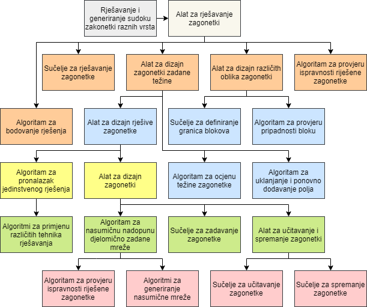
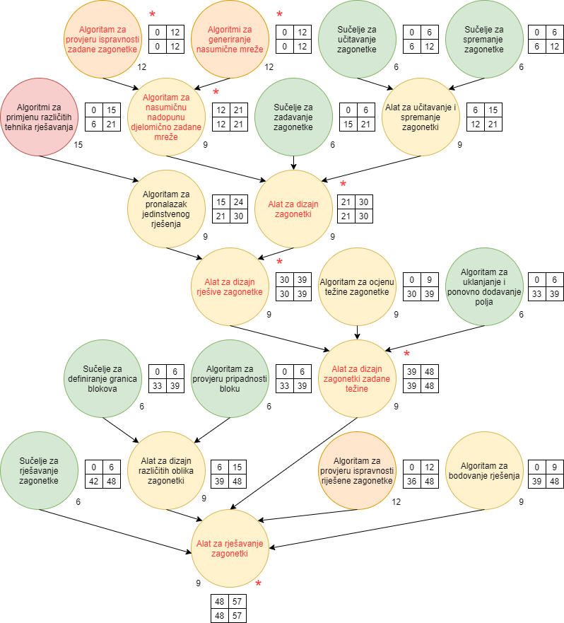
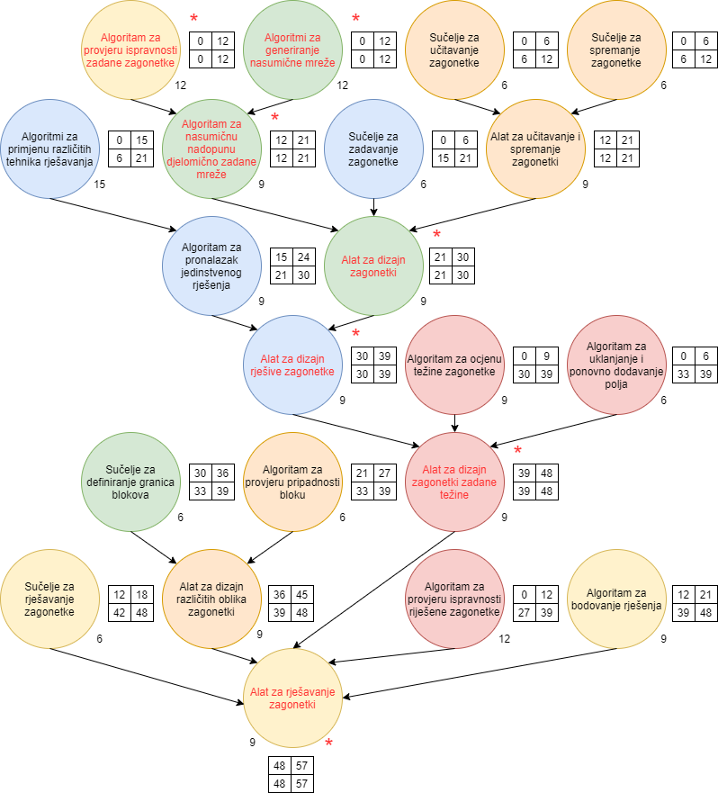

# WBS

# PERT prije podjele rada po osobama

| I | Opis zadatka | T | Preduvjet | K | PAV | ZAV | D | EX | PAD | ZAD |
|---|---|---|---|---|---|---|---|---|---|---|
| A | Algoritam za provjeru ispravnosti zadane zagonetke | 12 |  | * | 0 | 12 | 4 | DJ | 29.3 | 1.4 |
| B | Algoritmi za generiranje nasumične mreže | 12 |  | * | 0 | 12 | 4 | BB | 29.3 | 1.4 |
| C | Algoritam za nasumičnu nadopunu djelomično zadane mreže | 9 | A, B | * | 12 | 21 | 3 | BB | 2.4 | 7.4 |
| D | Sučelje za učitavanje zagonetke | 6 |  |  | 0, 6 | 6, 12 | 2 | BS | 29.3, 31.3 | 30.3, 1.4 |
| E | Sučelje za spremanje zagonetke | 6 |  |  | 0, 6 | 6, 12 | 2 | BS | 29.3, 31.3 | 30.3, 1.4 |
| F | Alat za učitavanje i spremanje zagonetki | 9 | D, E |  | 6, 12 | 15, 21 | 3 | BS | 31.3, 2.4 | 2.4, 7.4 |  
|    G | Sučelje za zadavanje zagonetke | 6 |  |  | 0, 15 | 6, 21| 2 | LŽ | 29.3, 6.4 | 30.3, 7.4|
 |  H | Alat za dizajn zagonetki | 9 | C, F, G | * | 21 | 30 | 3 | BB | 8.4 | 12.4 |
|  I | Algoritmi za primjenu različitih tehnika rješavanja | 15 |  |  | 0, 6 | 15, 21 | 5 | LŽ | 29.3, 31.3 | 2.4, 7.4 |
  |  J | Algoritam za pronalazak jedinstvenog rješenja | 9 | I |  | 15, 21 | 24, 30 | 3 | LŽ | 6.4, 8.4 | 8.4, 12.4 |
   |  K | Alat za dizajn rješive zagonetke | 9 | H, J | * | 30 | 39 | 3 | LŽ | 13.4 | 15.4 |
 |  L | Algoritam za ocjenu težine zagonetke | 9 |  |  | 0, 30 | 9, 39 | 3 | MP | 29.3, 13.4 | 31.3, 15.4 |
|  M | Algoritam za uklanjanje i ponovno dodavanje polja | 6 |  |  | 0, 33 | 6, 39 | 2 | MP | 29.3, 14.4 | 30.3, 15.4 |
 |  N | Alat za dizajn zagonetki zadane težine | 9 |  K, L, M | * | 39 | 48 | 3 | MP | 16.4 | 20.4 |
| O | Sučelje za definiranje granica blokova | 6 |  |  | 0, 33 | 6, 39 | 2 | BB | 29.3, 14.4 | 30.3, 15.4 |
| P | Algoritam za provjeru pripadnosti bloku | 6 |  |  | 0, 33 | 6, 39 | 2 | BS | 29.3, 14.4 | 30.3, 15.4 |
|  Q | Alat za dizajn različitih oblika zagonetki | 9 | O, P  | * | 6, 39 | 15, 48 | 3 | BS | 31.3, 16.4 | 2.4, 20.4 |
|  R | Sučelje za rješavanje zagonetke | 6 |  |  | 0, 42 | 6, 48 | 2 | DJ | 29.3, 19.4 | 30.3, 20.4 |
| S | Algoritam za provjeru ispravnosti riješene zagonetke | 12 |  |  | 0, 36 | 12, 48 | 4 | MP | 29.3, 15.4 | 1.4, 20.4 |
|  T | Algoritam za bodovanje rješenja | 9 |  | | 0, 39 | 9, 48 | 3 | DJ | 29.3, 16.4 | 31.3, 20.4 |
 |  U | Alat za rješavanje zagonetki | 9 | N, Q, R, S, T  | * | 48 | 57 | 3 | DJ | 21.4 | 23.4 |
    

I -  Oznaka zadatka, T - Trajanje u radnim satima, K - Kritični vrhovi

PAV - Početno apsolutno vrijeme, ZAV - Završno apsolutno vrijeme, EX - Izvršitelj zadatka

BB - Barbara Breš, DJ - Dorian Janžetić, MP - Mihael Petranović, BS - Borna Sila, LŽ - Lucija Žužić

D - Trajanje u radnim danima, PAD - Početno apsolutno vrijeme (dan), ZAD - Završno apsolutno vrijeme (dan)

# PERT nakon podjele rada po osobama

| I | Opis zadatka | T | Preduvjet | K | PAV | ZAV | D | EX | PAD | ZAD |
|---|---|---|---|---|---|---|---|---|---|---| 
| A | Algoritam za provjeru ispravnosti zadane zagonetke | 12 |  | * | 0 | 12 | 4 | DJ | 29.3 | 1.4 | 
| B | Algoritmi za generiranje nasumične mreže | 12 |  | * | 0 | 12 | 4 | BB | 29.3 | 1.4 | 
| C | Algoritam za nasumičnu nadopunu djelomično zadane mreže | 9 | A, B | * | 12 | 21 | 3 | BB | 2.4 | 7.4 | 
| D | Sučelje za učitavanje zagonetke | 6 |  |  | 0, 6 | 6, 12 | 2 | BS | 29.3, 31.3 | 30.3, 1.4 | 
| E | Sučelje za spremanje zagonetke | 6 |  |  | 0, 6 | 6, 12 | 2 | BS | 29.3, 31.3 | 30.3, 1.4 | 
| F | Alat za učitavanje i spremanje zagonetki | 9 | D, E |  | 12 | 21 | 3 | BS | 2.4 | 7.4 |  
| G | Sučelje za zadavanje zagonetke | 6 |  |  | 0, 15 | 6, 21| 2 | LŽ | 29.3, 6.4 | 30.3, 7.4| 
| H | Alat za dizajn zagonetki | 9 | C, F, G | * | 21 | 30 | 3 | BB | 8.4 | 12.4 | 
| I | Algoritmi za primjenu različitih tehnika rješavanja | 15 |  |  | 0, 6 | 15, 21 | 5 | LŽ | 29.3, 31.3 | 2.4, 7.4 | 
| J | Algoritam za pronalazak jedinstvenog rješenja | 9 | I |  | 15, 21 | 24, 30 | 3 | LŽ | 6.4, 8.4 | 8.4, 12.4 | 
| K | Alat za dizajn rješive zagonetke | 9 | H, J | * | 30 | 39 | 3 | LŽ | 13.4 | 15.4 | 
| L | Algoritam za ocjenu težine zagonetke | 9 |  |  | 0, 30 | 9, 39 | 3 | MP | 29.3, 13.4 | 31.3, 15.4 | 
| M | Algoritam za uklanjanje i ponovno dodavanje polja | 6 |  |  | 0, 33 | 6, 39 | 2 | MP | 29.3, 14.4 | 30.3, 15.4 | 
| N | Alat za dizajn zagonetki zadane težine | 9 |  K, L, M | * | 39 | 48 | 3 | MP | 16.4 | 20.4 | 
| O | Sučelje za definiranje granica blokova | 6 |  |  | 30, 33 | 36, 39 | 2 | BS | 13.4, 14.4 | 14.4, 15.4 | 
| P | Algoritam za provjeru pripadnosti bloku | 6 |  |  | 21, 33 | 27, 39 | 2 | BS | 8.4, 14.4 | 9.4, 15.4 | 
| Q | Alat za dizajn različitih oblika zagonetki | 9 | O, P  | * | 36, 39 | 45, 48 | 3 | BS | 15.4, 16.4 | 19.4, 20.4 | 
| R | Sučelje za rješavanje zagonetke | 6 |  |  | 12, 42 | 18, 48 | 2 | DJ | 2.4, 19.4 | 6.4, 20.4 | 
| S | Algoritam za provjeru ispravnosti riješene zagonetke | 12 |  |  | 0, 27 | 12, 39 | 4 | MP | 29.3, 12.4 | 1.4, 15.4 | 
| T | Algoritam za bodovanje rješenja | 9 |  | | 12, 39 | 21, 48 | 3 | DJ | 2.4, 16.4 | 7.4, 20.4 | 
| U | Alat za rješavanje zagonetki | 9 | N, Q, R, S, T  | * | 48 | 57 | 3 | DJ | 21.4 | 23.4 | 

I -  Oznaka zadatka, T - Trajanje u radnim satima, K - Kritični vrhovi

PAV - Početno apsolutno vrijeme, ZAV - Završno apsolutno vrijeme, EX - Izvršitelj zadatka

BB - Barbara Breš, DJ - Dorian Janžetić, MP - Mihael Petranović, BS - Borna Sila, LŽ - Lucija Žužić

D - Trajanje u radnim danima, PAD - Početno apsolutno vrijeme (dan), ZAD - Završno apsolutno vrijeme (dan)

# Model procesa razvoja programskog proizvoda - SCRUM/Kanban

 | Scrum | Kanban |
 |---|---|
| Kraće iteracije | Vizualizacija na GitHub-u (stupci To do, Doing, Done) |
| Planiranje na zahtjev i prioriteti zadataka (issues unutar milestones) | Ograničenje na Work in Progress (WIP) |
| Scrum Master (voditelj projekta) dodjeljuje zadatke | Dodatna faza (Code Review za pull request) |
| Kratki sastanci i retrospektive (tjedno ili češće) | Točka predaje ili isporuke (due by, deliverables) |

# Optimistična, pesimistična i realistična predviđanja trajanja zadataka te izračun varijance i rizika

| I | Opis zadatka | O | R | P | Dur. | Risk | Var. |
|---|---|---|---|---|---|---|---|
| A | Algoritam za provjeru ispravnosti zadane zagonetke | 9 | 12 | 18 | 12.50 | 1.50 | 2.25 | 
| B | Algoritmi za generiranje nasumične mreže | 9 | 12 | 18 | 12.50 | 1.50 | 2.25 | 
| C | Algoritam za nasumičnu nadopunu djelomično zadane mreže | 6 | 9 | 12 | 9.00 | 1.00 | 1.00 | 
| D | Sučelje za učitavanje zagonetke | 3 | 6 | 9 | 6.00 | 1.00 | 1.00 | 
| E | Sučelje za spremanje zagonetke | 3 | 6 | 9 | 6.00 | 1.00 | 1.00 | 
| F | Alat za učitavanje i spremanje zagonetki | 6 | 9 | 12 | 9.00 | 1.00 | 1.00 | 
| G | Sučelje za zadavanje zagonetke | 3 | 6 | 9 | 6.00 | 1.00 | 1.00 | 
| H | Alat za dizajn zagonetki | 6 | 9 | 12 | 9.00 | 1.00 | 1.00 | 
| I | Algoritmi za primjenu različitih tehnika rješavanja | 12 | 15 | 21 | 15.50 | 1.50 | 2.25 | 
| J | Algoritam za pronalazak jedinstvenog rješenja | 6 | 9 | 12 | 9.00 | 1.00 | 1.00 | 
| K | Alat za dizajn rješive zagonetke | 6 | 9 | 12 | 9.00 | 1.00 | 1.00 | 
| L | Algoritam za ocjenu težine zagonetke | 6 | 9 | 15 | 9.50 | 1.50 | 2.25 | 
| M | Algoritam za uklanjanje i ponovno dodavanje polja | 3 | 6 | 9 | 6.00 | 1.00 | 1.00 | 
| N | Alat za dizajn zagonetki zadane težine | 6 | 9 | 12 | 9.00 | 1.00 | 1.00 | 
| O | Sučelje za definiranje granica blokova | 3 | 6 | 9 | 6.00 | 1.00 | 1.00 | 
| P | Algoritam za provjeru pripadnosti bloku | 3 | 6 | 9 | 6.00 | 1.00 | 1.00 | 
| Q | Alat za dizajn različitih oblika zagonetki | 6 | 9 | 12 | 9.00 | 1.00 | 1.00 | 
| R | Sučelje za rješavanje zagonetke | 3 | 6 | 9 | 6.00 | 1.00 | 1.00 | 
| S | Algoritam za provjeru ispravnosti riješene zagonetke | 9 | 12 | 18 | 12.50 | 1.50 | 2.25 | 
| T | Algoritam za bodovanje rješenja | 6 | 9 | 15 | 9.50 | 1.50 | 2.25 | 
| U | Alat za rješavanje zagonetki | 6 | 9 | 12 | 9.00 | 1.00 | 1.00 | 
|  | Zbrojeno  |  |  |  |  186.00 | 24.00 | 28.50 | 

Oznaka zadatka, O - Optimistično trajanje u radnim satima, R - Realistično trajanje u radnim satima

P- Pesimistično trajanje u radnim satima, Dur. - Trajanje u radnim satima, Risk - Rizik, Var. - Varijanca

Procjena trajanja pomoću tri točke
| Pouzdanost |  Minimalno trajanje |  Maksimalno trajanje |
|---|---|---|  
| 1 Sigma - 68\% |  162.00 |  210.00 |  
| 2 Sigma - 95\% |  138.00 |  234.00 |  
| 3 Sigma - 99\% |  114.00 |  258.00 |  