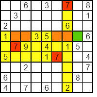
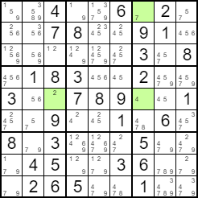

# Jednostavne tehnike 

Ove dvije jednostavne tehnike omogućavaju da rješimo većinu zagonetki, a ujedno su jedinke koje eksplicitno definiraju vrijednosti u ćelijama, dok ostale tehnike samo eliminiraju mogućnosti. 

## [Jedina pozicija (Single Position)](https://www.sudokuoftheday.com/about/techniques/single-position "Single Position")

U promatranu zelenu ćeliju (4, 8) može se upisati vrijednost 7 jer smo ju pomoću crveno označenih već poznatih vrijednosti 7 u drugim ćelijama eliminirali iz svih narančastih neispunjenih ćelija u istom retku (retku 4) kao i iz žutih neispunjenih ćelija koje se nalaze u drugim retcima. 



```java
public int singlePosition() {

		for (int val = 1; val <= rows; val++) {
			int[] usedRows = new int[rows];
			int[] usedCols = new int[cols];
			int[] usedBoxes = new int[rows * cols];
		    for (int i = 0; i < rows; i++){
		    	for (int j = 0; j < cols; j++) {
		    		usedRows[i] = 0;
		    		usedCols[j] = 0;
		    		usedBoxes[i] = 0;
			    }
		    }
		    for (int i = 0; i < rows; i++){
		    	for (int j = 0; j < cols; j++) {
		    		if (temporary[i * cols + j] == val) {
			    		usedRows[i]++;
			    		usedCols[j]++;
			    		usedBoxes[boxNumber[i * cols + j]]++;
		    		}
			    }
		    }
		    for (int i = 0; i < rows; i++){ 
		    	if (usedRows[i] == 1) {
		    		continue;
		    	}
		    	int possible = 0;
		    	int x = 0;
		    	for (int j = 0; j < cols; j++) {
		    		int b = boxNumber[i * cols + j];
		    		if (usedRows[i] == 0 && usedCols[j] == 0 && usedBoxes[b] == 0 && possibilities[i * cols + j][val - 1] != 0 && temporary[i * cols + j] == 0) {
		    			possible++;
		    			x = j;
		    		}
			    }
		    	if (possible == 1) {
		    		difficultyScore += 100 * 1;
		    		changed++;
		    		unset--;
			    	for (int k = 0; k < cols; k++) {
			    		possibilities[i * cols + x][k] = 0;
				    }
			    	possibilities[i * cols + x][val - 1] = 1;
			    	usedRows[i] = 1;
			    	usedCols[x] = 1;
			    	int b = boxNumber[i * cols + x];
			    	usedBoxes[b] = 1;
	    			solvingInstructions += "For row " + String.valueOf(i + 1) + ", number " + String.valueOf(val) + " is only possible in cell (" + String.valueOf(i + 1) + ", " + String.valueOf(x + 1) + ").\n";
		    		if (showSteps == true) {
		    		    instructionArea.setText(solvingInstructions);
    		    		print();
    	    			InformationBox.infoBox("For row " + String.valueOf(i + 1) + ", number " + String.valueOf(val) + " is only possible in cell (" + String.valueOf(i + 1) + ", " + String.valueOf(x + 1) + ").", "Solver");
		    		}
			    	temporary[i * cols + x] = val;
    		    	field[i * cols + x].setForeground(Color.BLACK);
		    		field[i * cols + x].setText(String.valueOf(val));
		    		fixPencilmarks();
		    		if (unset == 0) {
		    			difficulty.setText(String.valueOf(difficultyScore) + " Postoji jedinstveno rješenje");
		    			return 1;
		    		}
					if (sequence() == 1) {
		    			difficulty.setText(String.valueOf(difficultyScore) + " Postoji jedinstveno rješenje");
		    			return 1;
					}
		    	} 
		    }
		    for (int i = 0; i < cols; i++){ 
		    	if (usedCols[i] == 1) {
		    		continue;
		    	}
		    	int possible = 0;
		    	int x = 0;
		    	for (int j = 0; j < rows; j++) {
		    		int b = boxNumber[j * cols + i];
		    		if (usedRows[j] == 0 && usedCols[i] == 0 && usedBoxes[b] == 0 && possibilities[j * cols + i][val - 1] != 0 && temporary[j * cols + i] == 0) {
		    			possible++;
		    			x = j;
		    		}
			    }
		    	if (possible == 1) {
		    		difficultyScore += 100 * 1;
		    		changed++;
		    		unset--;
			    	for (int k = 0; k < cols; k++) {
			    		possibilities[x * cols + i][k] = 0;
				    }
			    	possibilities[x * cols + i][val - 1] = 1;
			    	usedRows[x] = 1;
			    	usedCols[i] = 1;
			    	int b = boxNumber[x * cols + i];
			    	usedBoxes[b] = 1;
	    			solvingInstructions += "For column " + String.valueOf(i + 1) + ", number " + String.valueOf(val) + " is only possible in cell (" + String.valueOf(x + 1) + ", " + String.valueOf(i + 1) + ").\n";
	    			temporary[x * cols + i] = val;
    		    	field[x * cols + i].setForeground(Color.BLACK);
		    		field[x * cols + i].setText(String.valueOf(val));
			    	fixPencilmarks();
		    		
		    		if (unset == 0) {
		    			difficulty.setText(String.valueOf(difficultyScore) + " Postoji jedinstveno rješenje");
		    			return 1;
		    		}
					if (sequence() == 1) {
		    			difficulty.setText(String.valueOf(difficultyScore) + " Postoji jedinstveno rješenje");
		    			return 1;
					}
		    	} 
		    }
		    for (int i = 0; i < cols; i++){ 
		    	if (usedBoxes[i] == 1) {
		    		continue;
		    	}
		    	int possible = 0;
		    	int x = 0;
		    	for (int j = 0; j < rows * cols; j++) {
		    		int b = boxNumber[j];
		    		if (b != i) {
		    			continue;
		    		}
		    		if (usedRows[j / cols] == 0 && usedCols[j % cols] == 0 && usedBoxes[b] == 0 && possibilities[j][val - 1] != 0 && temporary[j] == 0) {
		    			possible++;
		    			x = j;
		    		}
			    }
		    	if (possible == 1) {
		    		difficultyScore += 100 * 1;
		    		changed++;
		    		unset--;
			    	for (int k = 0; k < cols; k++) {
			    		possibilities[x][k] = 0;
				    }
			    	possibilities[x][val - 1] = 1;
			    	usedRows[x / cols] = 1;
			    	usedCols[x % cols] = 1;
			    	usedBoxes[boxNumber[x]] = 1;
	    			solvingInstructions += "For box " + String.valueOf(boxNumber[x] + 1) + ", number " + String.valueOf(val) + " is only possible in cell (" + String.valueOf(x / cols + 1) + ", " + String.valueOf(x % cols + 1) + ").\n";
	    			temporary[x] = val;
    		    	field[x].setForeground(Color.BLACK);
		    		field[x].setText(String.valueOf(val));
			    	fixPencilmarks();

		    		if (unset == 0) {
		    			difficulty.setText(String.valueOf(difficultyScore) + " Postoji jedinstveno rješenje");
		    			return 1;
		    		}
		    	} 
		    }
		}
		return 0;
	}
```
## [Jedina znamenka (Single Candidate)](https://www.sudokuoftheday.com/about/techniques/single-position "Single Candidate")

Nakon što smo upisali sve dozvoljene mogućnosti u sve ćelije mreže, možemo uočiti da se u svjetlo zelene ćelije na slici može upisati samo jedna vrijednost jer su sve ostale vrijednosti već upisane drugdje u isti redak, stupac ili kutiju.



```java
public int singleCandidate() {
    for (int i = 0; i < rows; i++){
        for (int j = 0; j < cols; j++) {
            if (temporary[i * cols + j] == 0) {
                int possibility = 0;
                for (int k = 0; k < cols; k++) {
                    possibility += possibilities[i * cols + j][k];
                }
                if (possibility == 1) {
                    difficultyScore += 100 * 1;
                    changed++;
                    unset--;
                    for (int k = 0; k < cols; k++) {
                        if (possibilities[i * cols + j][k] == 1) {		
                            solvingInstructions += "Number " + String.valueOf(k + 1) + " the only value possible in cell (" + String.valueOf(i + 1) + ", " + String.valueOf(j + 1) + ").\n";
                            if (showSteps == true) {
                                instructionArea.setText(solvingInstructions);
                                print();
                                InformationBox.infoBox("Number " + String.valueOf(k + 1) + " the only value possible in cell (" + String.valueOf(i + 1) + ", " + String.valueOf(j + 1) + ")", "Solver");
                            }
                            temporary[i * cols + j] = k + 1;
                            field[i * cols + j].setForeground(Color.BLACK);
                            field[i * cols + j].setText(String.valueOf(k + 1));
                            fixPencilmarks();
                            break;
                        }
                    }
                    if (unset == 0) {
                        difficulty.setText(String.valueOf(difficultyScore) + " Postoji jedinstveno rješenje");
                        return 1;
                    }
                    if (sequence() == 1) {
                        difficulty.setText(String.valueOf(difficultyScore) + " Postoji jedinstveno rješenje");
                        return 1;
                    }

                }
            }
        }
    }
    return 0;
}
```